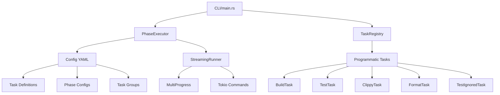

# Development Automation (xtask)

The `xtask` utility provides development automation for the Eidetica project using the [cargo xtask pattern](https://github.com/matklad/cargo-xtask). It orchestrates build tasks, tests, linters, formatters, and CI workflows with intelligent execution ordering and real-time progress feedback.

## Overview

**Location**: `crates/xtask/`

**Key Features**:

- Three-phase execution model (Fix → Format → Validate)
- Parallel and serial execution based on task characteristics
- Real-time streaming output with progress indicators
- Task dependency resolution with topological sorting
- Hybrid YAML + programmatic task system
- Task groups for common workflows (ci, dev, fix, lint, etc.)

**Primary Interface**:

```bash
cargo xtask <command>
```

## Architecture

### Core Components



#### PhaseExecutor

**File**: `phase_executor.rs`

Orchestrates task execution with phase-based organization:

- Loads task configuration from YAML
- Resolves task dependencies via topological sort
- Groups tasks by execution phase
- Executes phases in order (fix → format → validate)
- Runs parallel tasks concurrently within phases
- Handles error propagation and ignore_errors flag

**Key Methods**:

- `execute_tasks()` - Run tasks with dependency resolution
- `execute_group()` - Run a named task group
- `resolve_dependencies()` - Topological sort for correct execution order

#### StreamingRunner

**File**: `streaming.rs`

Manages real-time command output with progress visualization:

- Spawns async tokio processes
- Captures stdout/stderr with line-by-line streaming
- Updates progress bars with latest output line
- Displays failures immediately with formatted error output
- Separates stdout and stderr in failure reports
- Clears successful task panels after completion

**Visual Output**:

- Spinner animations during execution
- Line count and latest output preview
- Success (✅) / Failure (❌) indicators
- Timing information in verbose mode
- Full-width terminal-aware error formatting

#### Config System

**Files**: `config.rs`, `xtask.yml`

YAML-based task configuration supporting:

- **Phases**: Define execution characteristics (parallel/serial, icons, descriptions)
- **Tasks**: Nested task definitions with dependencies and commands
- **Groups**: Named collections of tasks for workflows
- **Commands**: Simple arrays or complex configs with env vars and working directories

**Task Node Structure**:

- Tasks can be flat (`clippy`) or nested (`build:release`, `test:doc`)
- Special `_default` key for nested task groups
- Tags for categorization and filtering

### Hybrid Execution Model

The system supports both YAML-defined and programmatic tasks:

**YAML Tasks** (via PhaseExecutor):

- Defined in `xtask.yml`
- Execute shell commands
- Good for simple workflows

**Programmatic Tasks** (via TaskRegistry):

- Implemented in Rust (`tasks/` directory)
- Type-safe with full language features
- Example: `TestIgnoredTask` parses source code for ignore reasons

## Three-Phase Execution Model

Tasks are organized into three phases that execute sequentially, with strategic parallelization within each phase:

```text
┌─────────────────────────────────────────────────────────────────┐
│                    🔧 PHASE 1: FIX                             │
│                   (Serial Execution)                           │
│  ┌─────────────────┐    ┌─────────────────┐                   │
│  │  Clippy --fix   │ →  │   More fixes    │ →  ...            │
│  └─────────────────┘    └─────────────────┘                   │
│  Semantic code changes that might conflict                     │
└─────────────────────────────────────────────────────────────────┘
                                ↓
┌─────────────────────────────────────────────────────────────────┐
│                   ✨ PHASE 2: FORMAT                           │
│                  (Parallel Execution)                          │
│  ┌─────────────────┐  ┌─────────────────┐  ┌─────────────────┐ │
│  │   Cargo fmt     │  │   Alejandra     │  │    Prettier     │ │
│  │   (Rust code)   │  │  (Nix files)    │  │  (Web files)    │ │
│  └─────────────────┘  └─────────────────┘  └─────────────────┘ │
│  Visual-only changes that don't conflict                       │
└─────────────────────────────────────────────────────────────────┘
                                ↓
┌─────────────────────────────────────────────────────────────────┐
│                  ✅ PHASE 3: VALIDATE                          │
│                  (Parallel Execution)                          │
│  ┌─────────────────┐  ┌─────────────────┐  ┌─────────────────┐ │
│  │     Build       │  │      Test       │  │     Clippy      │ │
│  │  (Type check)   │  │   (Run tests)   │  │   (Read-only)   │ │
│  │                 │  │                 │  │                 │ │
│  └─────────────────┘  └─────────────────┘  └─────────────────┘ │
│  Read-only verification that doesn't modify code               │
└─────────────────────────────────────────────────────────────────┘
```

### Phase Characteristics

#### 🔧 Fix Phase

- **Purpose**: Modify code semantically (logic, structure, imports)
- **Execution**: Serial (one at a time)
- **Rationale**: Prevents conflicting modifications to the same files
- **Examples**: `cargo clippy --fix`, auto-imports, dead code removal

#### ✨ Format Phase

- **Purpose**: Visual/style changes (whitespace, indentation)
- **Execution**: Parallel (formatters operate on different file types)
- **Rationale**: Formatters are deterministic and file-type-specific
- **Examples**: `cargo fmt` (Rust), `alejandra` (Nix), `prettier` (Web)

#### ✅ Validate Phase

- **Purpose**: Read-only verification
- **Execution**: Parallel (no mutation conflicts)
- **Rationale**: Checks can run independently without interference
- **Examples**: `cargo test`, `cargo build`, `cargo clippy` (check only)

### Benefits

- **⚡ Faster**: Parallel execution where safe
- **🛡️ Safer**: Serial execution where conflicts possible
- **🎯 Cleaner**: Clear separation of concerns
- **📈 Scalable**: Easy to add new tasks in any phase

## YAML Configuration Reference

### Phase Definition

```yaml
phases:
  phase_name:
    name: "Display Name"
    description: "What this phase does"
    parallel: true # or false for serial execution
    icon: "🔧" # Display icon
```

### Task Definition

**Simple Task**:

```yaml
tasks:
  task_name:
    description: "Task description"
    phase: validate
    tags: [test, check]
    commands:
      - ["cargo", "test"]
```

**Complex Task with Dependencies**:

```yaml
tasks:
  task_name:
    description: "Task description"
    phase: validate
    tags: [test]
    dependencies: [build] # Runs after 'build' completes
    ignore_errors: false # Propagate failures
    commands:
      - cmd: ["cargo", "test"]
        working_dir: "examples/todo"
        env:
          RUST_LOG: "debug"
```

**Nested Tasks**:

```yaml
tasks:
  build:
    _default: # Runs when 'build' is invoked
      description: "Default build"
      phase: validate
      commands:
        - ["cargo", "build"]

    release: # Runs when 'build:release' is invoked
      description: "Release build"
      phase: validate
      commands:
        - ["cargo", "build", "--release"]
```

### Group Definition

```yaml
groups:
  group_name:
    description: "Group description"
    tasks:
      - task1
      - task2
      - nested:variant
```

## CLI Reference

### Core Commands

**Run a specific task**:

```bash
cargo xtask run <task-name>
cargo xtask <task-name>  # Shortcut for common tasks
```

**Run a task group**:

```bash
cargo xtask group <group-name>
cargo xtask <group-name>  # Shortcut for predefined groups
```

**List tasks and groups**:

```bash
cargo xtask list              # List all tasks
cargo xtask list --groups     # List all groups
cargo xtask list --detailed   # Show descriptions
cargo xtask list --tags lint  # Filter by tag
```

### Task Shortcuts

Direct commands that map to common tasks:

- `cargo xtask build [--release] [--features=...] [--examples]`
- `cargo xtask test [--all] [--doc] [--book] [filter]`
- `cargo xtask test-ignored [--quiet] [--json] [filter]`
- `cargo xtask clippy [--fix] [--allow-warnings]`
- `cargo xtask format [--check] [--rust] [--nix] [--prettier]`

### Group Shortcuts

Direct commands for common workflows:

- `cargo xtask ci` - Full CI pipeline (build, test, clippy, doc, audit)
- `cargo xtask dev` - Quick feedback (build, test, clippy)
- `cargo xtask fix` - Auto-fixes and formatters (clippy --fix, fmt, alejandra, prettier)
- `cargo xtask lint` - All linters without fixes (clippy, fmt --check)
- `cargo xtask test-all` - All test suites including ignored
- `cargo xtask release` - Release build

### Global Options

- `--dry-run` - Show what would be executed without running
- `--verbose` / `-v` - Show real-time command output and timing

### Shell Completions

Generate completions for your shell:

```bash
cargo xtask completions bash > ~/.local/share/bash-completion/completions/xtask
cargo xtask completions zsh > ~/.zfunc/_xtask
```

## Available Tasks

### Build Tasks

- `build` - Build all targets with all features
- `build:release` - Release build
- `build:examples` - Build and check examples

### Test Tasks

- `test` - Run tests with nextest
- `test:all` - Include ignored tests
- `test:doc` - Documentation tests
- `test:book` - mdbook example tests

### Code Quality

- `clippy` - Run clippy lints
- `clippy:fix` - Auto-fix clippy warnings
- `fmt` - Format Rust code
- `fmt:check` - Check formatting without changes
- `alejandra` - Format Nix files
- `prettier` - Format web files

### Documentation

- `doc` - Build API documentation
- `book:build` - Build mdbook
- `book:serve` - Serve mdbook locally
- `book:test` - Test mdbook examples

### Security & Analysis

- `audit` - Check for security vulnerabilities
- `deny:check` - Check licenses and dependencies
- `bench` - Run benchmarks
- `coverage` - Generate test coverage

### Specialized Tasks

- `test-ignored` - Run ignored tests with annotations showing why they're ignored

## Task Groups

Predefined workflows combining multiple tasks:

- **ci**: Full CI validation (build, test, test:doc, clippy, doc, audit, deny:check, build:examples)
- **dev**: Quick development feedback (build, test, clippy)
- **fix**: Auto-fixes and formatters (clippy:fix, fmt, alejandra, prettier)
- **format**: All formatters (fmt, alejandra, prettier)
- **lint**: All linters (clippy, fmt:check)
- **test**: All test suites (test, test:doc, test:book)
- **test-all**: All tests including ignored
- **check**: All checks without modifications
- **release**: Release build preparation
- **book**: Documentation build and test
- **nix**: Nix operations (nix:check, nix:build)

## Usage Examples

### Development Workflow

**Quick feedback loop**:

```bash
# After making code changes
cargo xtask dev
# Runs: build → test → clippy in optimal order
```

**Before committing**:

```bash
# Apply fixes and format
cargo xtask fix
# Runs: clippy --fix (serial) → fmt + alejandra + prettier (parallel)
```

**Full validation**:

```bash
# Simulate CI locally
cargo xtask ci
```

### Working with Specific Tasks

**Run single task**:

```bash
cargo xtask test
cargo xtask clippy
cargo xtask build:release
```

**Chain related tasks** (via groups):

```bash
cargo xtask lint  # clippy + fmt:check (parallel)
```

**Debug with verbose output**:

```bash
cargo xtask test --verbose
```

**Dry run to see execution plan**:

```bash
cargo xtask ci --dry-run
```

### Running Ignored Tests

The `test-ignored` task scans source code for `#[ignore = "reason"]` annotations and displays them:

```bash
cargo xtask test-ignored
cargo xtask test-ignored --quiet  # Suppress test output
cargo xtask test-ignored --json   # JSON output
cargo xtask test-ignored pattern  # Filter by name
```

**Output Example**:

```text
  2.513s  PASS  eidetica::it sync::basic_sync
          └─ Requires network connectivity

  0.124s  FAIL  eidetica::it sync::advanced_test
          └─ Not yet implemented
```

## Adding New Tasks

### Adding a YAML Task

Edit `crates/xtask/xtask.yml`:

```yaml
tasks:
  my_task:
    description: "My custom task"
    phase: validate # or fix, format
    tags: [custom]
    dependencies: [build] # Optional
    commands:
      - ["cargo", "check", "--all-features"]
```

**With environment variables**:

```yaml
commands:
  - cmd: ["cargo", "test"]
    env:
      RUST_LOG: "debug"
      CUSTOM_VAR: "value"
```

**Nested tasks**:

```yaml
tasks:
  custom:
    _default:
      description: "Default variant"
      phase: validate
      commands:
        - ["echo", "default"]

    special:
      description: "Special variant"
      phase: validate
      commands:
        - ["echo", "special"]
```

Usage: `cargo xtask custom` or `cargo xtask custom:special`

### Adding a Programmatic Task

Create a new file in `crates/xtask/src/tasks/`:

**1. Define the task struct**:

```rust,ignore
// crates/xtask/src/tasks/my_task.rs
use anyhow::Result;

#[derive(Debug, Clone)]
pub struct MyTask {
    pub option: bool,
}

impl Default for MyTask {
    fn default() -> Self {
        Self { option: false }
    }
}

impl MyTask {
    pub fn description(&self) -> &str {
        "My custom task description"
    }

    pub fn tags(&self) -> Vec<&str> {
        vec!["custom"]
    }

    pub async fn execute(&self, ctx: &crate::TaskContext) -> Result<()> {
        if ctx.dry_run {
            println!("Would execute my task");
            return Ok(());
        }

        // Your task logic here
        println!("Executing my task");
        Ok(())
    }
}
```

**2. Add to task enum** in `tasks/mod.rs`:

```rust,ignore
pub enum Task {
    // ... existing variants
    MyTask(MyTask),
}
```

**3. Implement TaskHolder methods**:

```rust,ignore
impl TaskHolder {
    pub fn name(&self) -> &str {
        match &self.inner {
            // ... existing matches
            Task::MyTask(_) => "my-task",
        }
    }

    // Add similar matches in other methods...
}
```

**4. Register in registry**:

```rust,ignore
pub fn create_registry() -> crate::TaskRegistry {
    let mut registry = crate::TaskRegistry::new();

    // ... existing registrations
    registry.register("my-task".to_string(), Task::MyTask(MyTask::default()));

    registry
}
```

### Adding a Task Group

Edit `crates/xtask/xtask.yml`:

```yaml
groups:
  my_workflow:
    description: "My custom workflow"
    tasks:
      - build
      - my_task
      - test
```

Usage: `cargo xtask group my_workflow`

## Implementation Notes

### Dependency Resolution

Tasks are executed in dependency order using topological sorting:

1. Collect all dependencies recursively
2. Topological sort ensures dependencies run before dependents
3. Circular dependencies are detected and reported
4. Tasks are grouped by phase after resolution

### Error Handling

- By default, task failures stop execution
- Use `ignore_errors: true` to continue on failure
- Programmatic tasks can implement custom error handling
- Failed tasks display full stdout/stderr with terminal-width formatting

### Progress Display

- Main progress bar shows overall status
- Individual task spinners with latest output line
- Success tasks clear after brief delay
- Failed tasks remain visible with ❌ indicator
- All output captured and displayed on failure
- Terminal width detected for proper formatting

### Performance Considerations

- Parallel execution within phases maximizes throughput
- Serial execution in fix phase prevents file conflicts
- Async task spawning with tokio for efficiency
- Streaming output avoids memory buildup
- Progress updates throttled to reduce overhead

## Related Files

- `crates/xtask/src/main.rs` - CLI interface and command routing
- `crates/xtask/src/lib.rs` - Core types and registry
- `crates/xtask/src/phase_executor.rs` - Phase-based execution engine
- `crates/xtask/src/streaming.rs` - Real-time output handling
- `crates/xtask/src/config.rs` - YAML configuration parsing
- `crates/xtask/src/tasks/` - Programmatic task implementations
- `crates/xtask/xtask.yml` - Task definitions
- `Taskfile.yml` - Integration with taskfile.dev (calls xtask)
