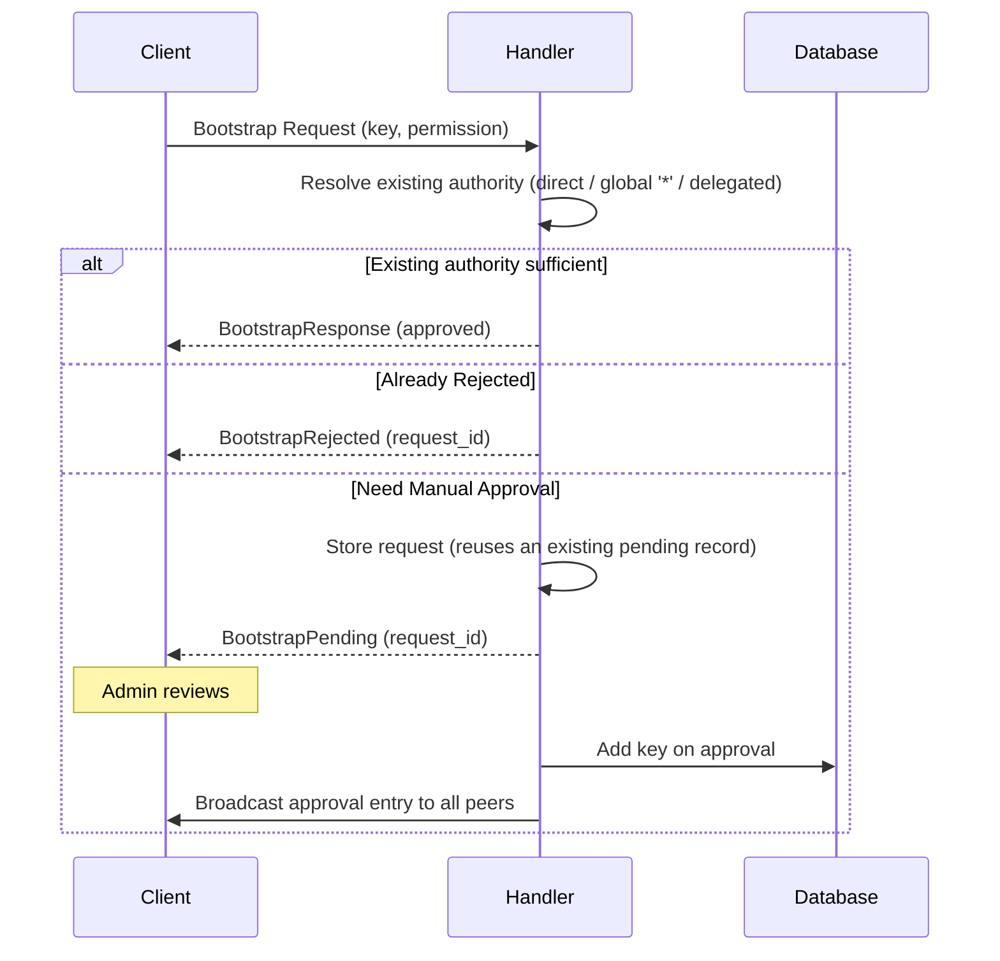

# Bootstrap

Secure key management and access control for new devices joining existing databases.

## Architecture

Bootstrap requests are stored in the sync database (`_sync`), not target databases. A request is auto-approved when the requesting key already holds sufficient authority on the target database; otherwise it enters the manual approval workflow.

## Request Flow



## Existing-Authority Auto-Approval

If the requesting key already has sufficient permission on the target database, approval is immediate without adding a new key. The check resolves authority through the same discovery path the rest of the auth layer uses (`Database::find_sigkeys`), so it recognizes:

- a **direct** key entry for the requesting pubkey,
- a **global `*`** grant, and
- authority reaching the database **only through a delegated database** — the requesting key is a member of a database this one delegates to.

Revoked keys are never treated as sufficient. When no existing authority satisfies the request, it falls through to the manual approval workflow below.

Permission hierarchy uses **lower numbers = higher priority**:

- Global `Write(10)` allows requests for `Read`, `Write(11)`, `Write(15)`
- Global `Write(10)` rejects requests for `Write(5)`, `Admin(*)`

### Delegation discovery is one hop deep

Discovery searches only the databases the target database delegates to **directly**. A key whose authority arrives through a chain — the target delegates to A, A delegates to B, and the key is held in B — is not found, and the request falls through to manual approval.

This is a limitation of _discovery_, not of delegation itself. Entry validation resolves delegation paths of arbitrary length, because a signer names its own path in the signature and the resolver merely walks it, clamping permission bounds at each step. Bootstrap has no such path: the client presents a bare public key, so the server has to search for one, and the search is currently a single level.

Lifting the limit means either making discovery recursive or letting the client supply its delegation path in the request as a search hint. The latter is cheaper, and safe for the same reason the named path is safe during validation — every step is checked against the server's own settings and tips, so a hint can only fail to resolve, never grant.

## Manual Approval API

```rust,ignore
// Query requests
sync.pending_bootstrap_requests()?;
sync.approved_bootstrap_requests()?;

// Approve/reject
sync.approve_bootstrap_request(id, signing_key)?;
sync.reject_bootstrap_request(id, signing_key)?;
```

## Broadcast on Approval

On approval the handler adds the requesting key to the target database and then
broadcasts the resulting auth entry to **all** of the database's peers via the
normal outbound send queue, independent of `sync_on_commit`. The requesting peer
is one of those peers (registered during its sync request), so the broadcast is
how it sees that access was granted without relying on a poll interval —
improving time-to-visibility under fluctuating network conditions. Delivery
reuses the send queue's retry/backoff for unreachable peers and is best-effort:
an enqueue failure is logged and does not undo the committed approval.

## Request Status

- **Pending**: Awaiting admin review
- **Approved**: Key added to database and broadcast to peers
- **Rejected**: Request denied, no key added

Requests are retained indefinitely for audit trail.

Storage is idempotent per `(tree_id, requesting_pubkey, requested_permission)`: a
re-request reuses an existing `Pending` or `Rejected` record instead of inserting
another, so a retrying client cannot append a row per attempt. `Approved` records
are not reused — the store path is only reached when the auth check found no live
grant, meaning the approval was revoked and a new request is correct.

A `Rejected` record answers subsequent requests with `BootstrapRejected`, a
terminal answer, rather than another pending wait.

See `src/sync/bootstrap_request_manager.rs` and `src/sync/handler.rs` for implementation.
